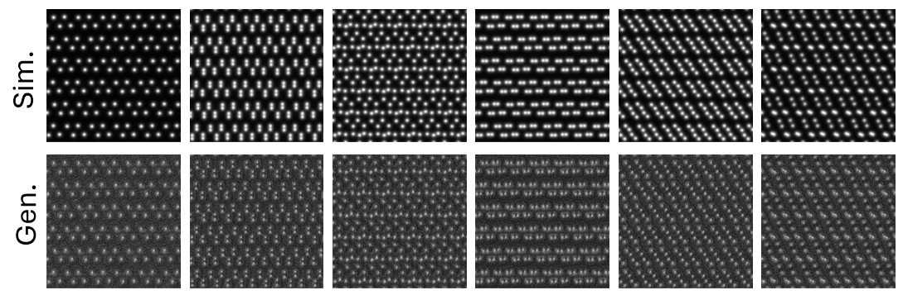
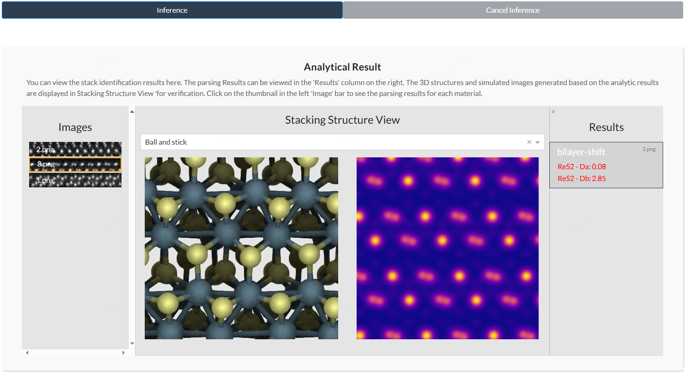

Official Repository for the paper Auto-resolving the atomic structure at van der Waals interfaces using a generative model.
==================================================

<a href="https://doi.org/10.5281/zenodo.14937026"></a>
<a href="https://opensource.org/licenses/MIT"></a>

Shortcuts
---------

- [TED-Gen](./train/)
- [Trident strategy enhanced DRIT](./Enhanced-DRIT/)
- [Generate simulation data by Computem](./Computem_Gen/)


**Note**: if you want to install or run our codes, please `cd` to subfolders first.


Auto-resolving the atomic structure at van der Waals interfaces using a generative model
-------------------------------------------------------------------

[[Paper](https://arxiv.org/abs/2408.16802)]

Authors: Wenqiang Huang, Yucheng Jin, Zhemin Li, Lin Yao*, Yun Chen, Zheng Luo, Shen Zhou, Hongxia Wang, Jinguo Lin, Feng Liu, Zhifeng Gao, Jun Cheng, Linfeng Zhang, Fangping Ouyang*, Shanshan Wang* & Jin Zhang* 

Unveiling atomic structures is significant for the relationship construction between microscopic configurations and macroscopic properties of materials.  However, we still lack a rapid, accurate, and robust approach to automatically resolve complex patterns in atomic-resolution microscopy.  Here, we present a Trident strategy-enhanced disentangled representation learning method (a generative model), which utilizes a few unlabeled experimental images with abundant low-cost simulated images to generate a large corpus of annotated simulation data that closely resembles experimental conditions, realizing simultaneous achievement of high quality and large volumes of the training dataset.  A structural inference model is then trained via a residual neural network which can directly deduce the interlayer slip and rotation of diversified and complicated stacking patterns at van der Waals (vdWs) interfaces with picometer-scale accuracy across various materials (ReS2, ReSe2, and MoS2) with different layer numbers (bilayer and trilayers) and demonstrates robustness to defects, imaging quality, and surface contaminations.  The framework can also identify pattern transition interfaces, quantify subtle motif variations, and discriminate moiré patterns that are undistinguishable in frequency domains.  The high-throughput processing ability of our method helps discover a novel vdW epitaxy where various thermodynamically favorable slip stackings can coexist, demonstrating the machine learning contribution to the new knowledge emergence.

## System Requirements

Hardware requirements
--------------------------------------------------------------------
For optimal performance, we recommend a computer with the following specs:

* RAM: 25+ GB

* CPU: 4+ cores, 2.4+ GHz/core

* GPU: 32 GB Tesla-V100 *1

Software requirements
--------------------------------------------------------------------

### OS Requirements

The development version is tested on Linux operating systems. The developmental version has been tested on the following systems:

* Linux: Ubuntu 20.04.5 LTS

* Mac OSX:

* Windows:

### Python Dependencies

Mainly depends on the following python packages.

```
ase
argparse
collections
cv2
functools
subprocess
sklearn
numpy
PIL
torch
torchvision
transformers
```

If you are having an issue that you believe to be tied to software versioning issues, please drop us an issue.

## Usage

Install Guide
--------------------------------------------------------------------
- Clone this repo:
```
git clone https://github.com/dptech-corp/TED-Gen.git
cd code
```

Download datasets
--------------------------------------------------------------------
Dataset of training Trident strategy-Enhanced-DRIT and Stacking-Pattern-Analyzer is available at [zenodo](https://zenodo.org/records/11446947)

#### optional download
|Dataset |Size of compressed version| Download link  |
|---    |---    |---    |
|TED  |   |   |
|ReS2    |12.6 MB   | [download all](https://zenodo.org/records/11446947/files/res2.tar.gz?download=1)   |
|ReSe2    |11.2 MB   | [download all](https://zenodo.org/records/11446947/files/rese2.tar.gz?download=1)   |
|MoS2    |28.9 MB   | [download all](https://zenodo.org/records/11446947/files/mos2.tar.gz?download=1)   |
|   |   |   |   |   |
|SPA |   |   |   |   |
|ReS2    |890.2 MB   | [download all](https://zenodo.org/records/11446947/files/res2.tar.gz?download=1)   |
|ReSe2    |2.4 GB   | [download all](https://zenodo.org/records/11446947/files/rese2_als.tar.gz?download=1)   |
|MoS2    |27.2 GB   | [part01](https://zenodo.org/records/11446947/files/mos2_als_part_aa?download=1) [part02](https://zenodo.org/records/11446947/files/mos2_als_part_ab?download=1) [part03](https://zenodo.org/records/11446947/files/mos2_als_part_ac?download=1) [part04](https://zenodo.org/records/11446947/files/mos2_als_part_ad?download=1) [part05](https://zenodo.org/records/11446947/files/mos2_als_part_ae?download=1) [part06](https://zenodo.org/records/11446947/files/mos2_als_part_af?download=1) [part07](https://zenodo.org/records/11446947/files/mos2_als_part_ag?download=1) [part08](https://zenodo.org/records/11446947/files/mos2_als_part_ah?download=1) [part09](https://zenodo.org/records/11446947/files/mos2_als_part_ai?download=1)|
|   |   |   |   |   |


Generate datasets
--------------------------------------------------------------------
You can also use the code we provide to generate simulated STEM images with or without noise.

### Generate noise-free simulated stem images
Simulated STEM images were generated by the open-source 'incoSTEM' package in Computem. In Ubuntu 20.04, you may need to manually install libfftw3 - dev to use incoSTEM. Otherwise might not be able to generate simulation images.

```
apt-get update
apt-get -y install libfftw3-dev
```

Based on our script, you can generate simulated STEM images containing specified stacking patterns.You can generate an image with label by running the ipynb file in [Computem_Gen subfolder](./Computem_Gen/).

You can also go to [this page](https://sourceforge.net/projects/computem/) to obtain Computem software with GUI.

Check [Computem_Gen](./Computem_Gen/) for more detalis.

### Generate realistic stem images with Trident strategy-Enhanced-DRIT
You can convert the noise-free stem images into realistic stem images using the [Trident strategy-Enhanced-DRIT](./Enhanced-DRIT/) model we provide.

Before you start [training](./Enhanced-DRIT/src/train.py) or [generating](./Enhanced-DRIT/src/test_transfer.py), please download the necessary model parameter files and datasets and configure them in the [option.py](./Enhanced-DRIT/src/options.py) file. If you want to train or test on your own dataset, change the *--dataroot* in the [option.py](./Enhanced-DRIT/src/options.py) file to the location of your own dataset.

For the format of the dataset, see [example_data](./datasets/example_data). The images in the [label folder](./datasets/example_data/label) are not necessary for some downstream tasks and are only used in the generation step. For defect detection tasks, you may need to place your own label images in this folder.

#### optional download
Here to download the TED model parameters used in the paper.

|Model parameter files|Size | Download link  |
|---    |---    |---    |
|ReS2    |780.3 MB   | [download](https://zenodo.org/records/11446947/files/modified_drit_res2.pth?download=1)   |
|ReSe2    |780.3 MB   | [download](https://zenodo.org/records/11446947/files/modified_drit_rese2.pth?download=1)   |
|MoS2    |780.3 MB   | [download](https://zenodo.org/records/11446947/files/modified_drit_mos2.pth?download=1)   |
|   |   |   |   |   |

You can also run the following code to download all model parameters

```
cd Enhanced-DRIT
bash ./models/download_model.sh
```

#### train model

You can train TED models using the datasets we provide or your own.

```
cd Enhanced-DRIT
python ./src/train.py
```

#### generate

You can use the model parameters we provide or your own trained model parameters to obtain realistic STEM images. In the recommended configuration, the average time to generate an 1024*1024 image is about 1s.

```
cd Enhanced-DRIT
python ./src/test_transfer.py
```

In the following figure, the top panel is the simulation image input, and the bottom panel is the TED generated images.

<p align="center"></p>
<p align="center"><b>Generation demo</b></p>


Check [Enhanced-DRIT](./Enhanced-DRIT/) for more detalis.

Stacking Pattern Analyzer
--------------------------------------------------------------------
Once the dataset is ready, you can train a stacking pattern analysis model based on the code we provide. Alternatively, you can parse your material using existing model parameters.

#### model parameters

* [ReS2(slip)](./Stacking-Pattern-Analyzer/model/res2_bs.pth)
* [ReSe2(slip)](./Stacking-Pattern-Analyzer/model/rese2_bs.pth)
* [MoS2(twist angel)](./Stacking-Pattern-Analyzer/model/mos2_rsub.pth)
* [ReS2(3layer slip)](./Stacking-Pattern-Analyzer/model/res2_ts.pth)


#### train model

You can train Stacking Pattern Analyzer models using the datasets we provide or your own.

```
cd Stacking-Pattern-Analyzer
python train.py
```

#### inference

We recommend using our [Online App](https://bohrium.dp.tech/apps/stacking-pattern-analyzer) to verify the parsing results.You can also test it in this [ipynb](./Stacking-Pattern-Analyzer/infer.ipynb) file. In the recommended configuration, inference in ipynb takes an average of about 1s per image.

<p align="center"></p>
<p align="center"><b>Online App</b></p>

Several bilayer slip stacking ReS2 raw images and inference are showing in the following figure

<p align="center"></p>
<p align="center"><b>Inference demo</b></p>

Check this [Stacking-Pattern-Analyzer](./Stacking-Pattern-Analyzer/) for more detalis.

Citation
--------

License
--------
This project is licensed under the terms of the MIT license. See [LICENSE](./LICENSE) for additional details.
